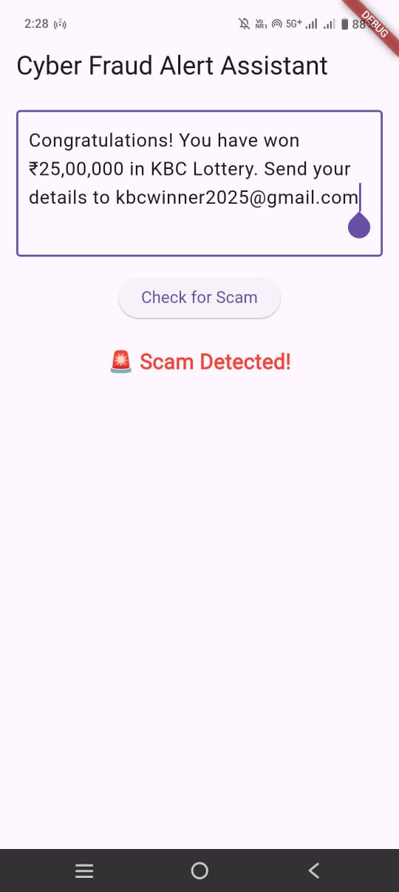
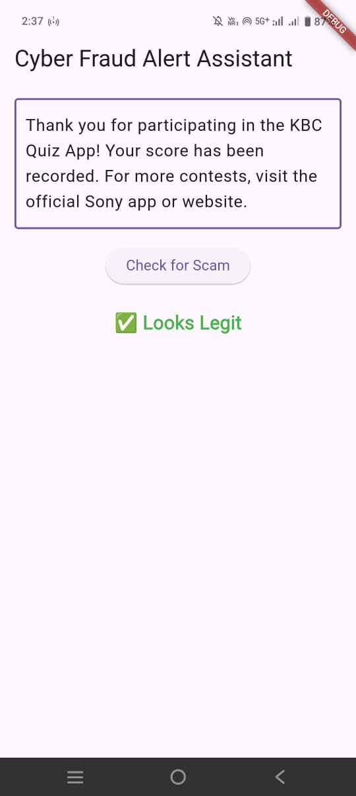
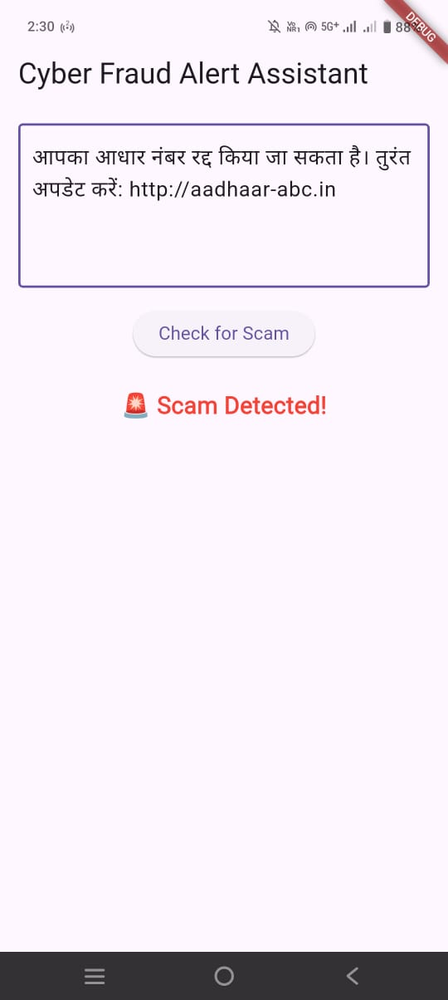
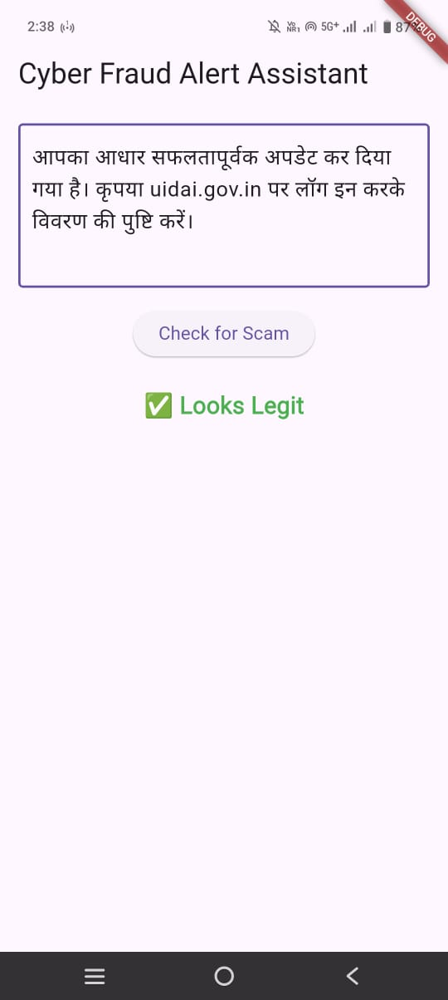
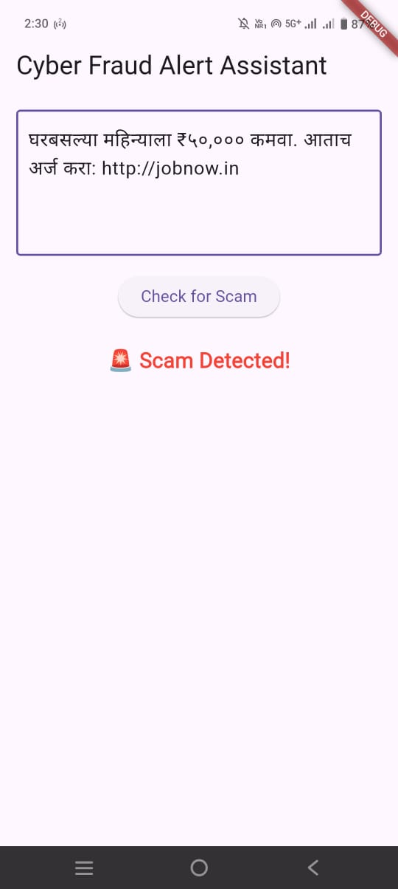
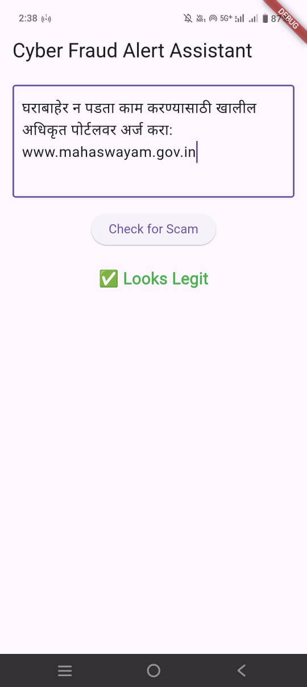

# 🛡️ Cyber Fraud Alert Assistant

A smart multilingual system that helps users detect fraud messages in **English, Hindi, and Marathi** using a machine learning model and a Flutter-based mobile app.

---

## 📌 Project Overview

- ✅ Trained ML model on real scam/legit messages in Hindi, Marathi & English  
- 📱 Flutter mobile app for message input and scam detection  
- 🧠 Real-time prediction using a hosted Flask API on Render  
- 🧪 Current version uses manual input; plans for auto detection and call monitoring  

---

1. **Flutter App** (mobile)  
2. Sends POST request to **Flask API** with suspect message  
3. Flask API preprocesses & vectorizes, runs **Logistic Regression** ML model  
4. Returns prediction: **🚨 Scam** or **✅ Legit**  
5. Flutter app displays result instantly

---

## 📱 App Demo: Scam vs Legit in 3 Languages

### English
| Scam | Legit |
|------|-------|
|  |  |

### Hindi
| Scam | Legit |
|------|-------|
|  |  |

### Marathi
| Scam | Legit |
|------|-------|
|  |  |

---

## 🧠 ML Model Details

- Languages supported: **Marathi**, **Hindi**, **English**  
- Text preprocessing: Lowercasing, Devanagari + English retention, stopword filtering  
- Feature extraction: **TF-IDF vectorization**  
- Model: **Logistic Regression** with ~95% accuracy on multilingual test sets  
- Deployment: Flask backend with `clean_text_mixed_with_stopwords`, `CountVectorizer`, `joblib` pickle files

---

## 🛠️ Tech Stack

| Component       | Tech / Tools                          |
|----------------|----------------------------------------|
| ML Model        | Python, scikit-learn, NLTK             |
| API             | Flask, Render hosting                  |
| Mobile App      | Flutter, Dart, `http` and `telephony` plugin |
| Communication   | HTTP POST (JSON)                       |

---

## 🚀 Future Roadmap & Tools

| Feature                          | Description | Tools / Libraries |
|----------------------------------|-------------|-------------------|
| Auto SMS Detection              | Listen to incoming SMS & auto-analyze | `telephony` plugin |
| Popup Scam Alerts               | Show notification toast/dialog when scam detected | `flutter_local_notifications`, background service |
| Fraud Call / Video Call Detector| Analyze call or video audio in real-time to detect scam | `speech_to_text`, Google STT, Vosk, Whisper, audio ML models |
| Fake Voice / Deepfake Detect    | Use voice fingerprinting to flag impersonation | `DeepSpeech` or custom audio embedding |
| Scan History                    | Store message scans locally using SQLite | `sqflite` plugin |
| ML on Device (offline mode)     | Use TFLite for local model inference | `tflite_flutter`, `onnxruntime` |
| Analytics Dashboard             | Admin dashboard for scam trends | Streamlit, Dash, Flask + JS charts |
| Multi-language NLP              | Add more language support | `IndicNLP`, `ai4bharat/indicBERT`, Hugging Face tokenizers |

---

## 📂 Repository Structure

cyber-fraud-alert-assistant/
├── fraud_alert_app_new/ # Flutter App
├── fraud_detection_api/ # Flask API with ML model
├── saved_models/ # Trained ML model (pickle/vectorizer)
├── model_training_notebooks / # EDA and ML model
├── data / # datasets 
├── screenshots/ # Demo and architecture images
└── README.md

---

## 📥 How to Run Locally

### 🔹 Flask API

cd flask_api/
pip install -r requirements.txt
python app.py

Flutter App
cd fraud_alert_app_new/
flutter pub get
flutter run

---

👏 Why This Project Matters
Combines ML and mobile for tackling cyber scams in local Indian languages

Covers end-to-end flow: from text input to prediction display

Demonstrates real-world problem-solving for rising scam threats

Offers thoughtfully planned features for future scalability and user safety

---

## 🤝 Credits

- Built by [Akash Sare](https://github.com/Akash-Sare03)
- Thanks to open-source contributors for libraries used

